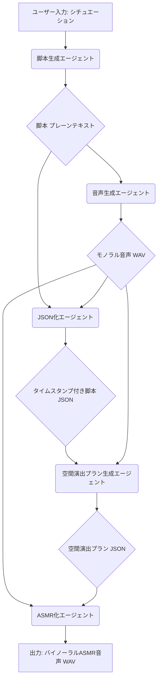

# [WIP] ASMR-GEN: 自動ASMRコンテンツ生成フレームワーク

[](https://deepmind.google/technologies/gemini/)
[](https://github.com/google/adk-python)

ASMR-GENは、シチュエーション（テキストプロンプト）を入力するだけで、没入感のあるバイノーラルASMR音声を自動生成するマルチエージェントアプリケーションです。

Google GeminiとAgent Development Kit (ADK)を主軸に設計されており、脚本作成から音声合成、そして高度な空間演出（バイノーラル化）までを一貫して自動化します。

## ✨ 主な特徴

ASMR-GENは、5つの専門エージェントによって構成されています。

1.  **動的な脚本生成 (Text to Text)**
    *   入力されたシチュエーションに基づき、Gemini 2.5 Proが状況解説とメインキャラクターの台詞を含む詳細な脚本を**プレーンテキスト形式で**生成します。
2.  **高品質な音声合成 (Text to Speech)**
    *   Gemini Text to Speech (TTS) を利用し、生成された脚本から自然なモノラル音声を生成します。
3.  **脚本の構造化とタイムスタンプ付与 (Audio-to-Text Alignment)**
    *   Gemini 2.5 Proのマルチモーダル機能を活用し、**プレーンテキストの脚本**と合成された音声を分析。各セリフの話者を特定し、正確な開始・終了タイムスタンプを付与した**構造化JSON**を生成します。
4.  **インテリジェントな空間演出プランニング (Context & Audio Analysis)**
    *   **本アプリの肝となる機能です。** Gemini 2.5 Proが、**構造化された脚本**と**音声のタイミング**の両方を分析し、没入感を最大化するための音源の位置、距離、響きを時系列で計画します。
5.  **リアルタイム・バイノーラルレンダリング (Speech to ASMR)**
    *   モノラル音声と空間演出プランを組み合わせ、HRTF（頭部伝達関数）処理を用いて立体的なASMR音声に変換します。

## 🏗️ アーキテクチャとワークフロー

ASMR-GENは、ADK (Agent Development Kit) を利用した**マルチエージェントアプリケーション**として設計されています。ADKのモジュール性を活かし、各エージェントが専門的なタスクを担当し、連携して最終的なコンテンツを生成します。

### ワークフロー

1.  **ユーザー入力**: シチュエーションを入力（例：「床屋さんでのマスターの語りかけ」）。
2.  **脚本生成**: 脚本生成エージェントが**プレーンテキスト形式**の脚本を作成。
3.  **音声生成**: 音声生成エージェントが脚本を読み上げ、モノラル音声を生成。
4.  **JSON化**: JSON化エージェントが**プレーンテキストの脚本**と音声を分析し、タイムスタンプ付きの**構造化脚本(JSON)**を作成。
5.  **空間演出プラン生成**: 空間演出エージェントが構造化脚本とモノラル音声を分析し、音響プラン（JSON）を作成。
6.  **ASMR化**: ASMR化エージェントがモノラル音声に音響プランを適用し、バイノーラルASMR音声（WAV）を出力。



## 📁 プロジェクト構成

### ディレクトリ構造

```
asmr-gen/
├── asmr_gen_adk/      # ADKアプリケーションのメインソースコード
│   ├── agents/        # 各機能担当エージェント
│   ├── tools/         # エージェントが使用するツール（音声処理など）
│   └── output/        # 生成された音声ファイルの出力先
├── doc/               # プロジェクト関連ドキュメント
├── sample/            # サンプルデータ（入力テキスト、音声など）
├── tests/             # テストコード
├── config.yaml        # モデル名などの設定ファイル
├── requirements.txt   # Pythonの依存パッケージリスト
└── README.md          # このファイル
```

### 主要なファイルとディレクトリの説明

*   `asmr_gen_adk/`: ADKアプリケーションのメインパッケージです。
*   `asmr_gen_adk/agent.py`: エージェント全体を統括し、処理の順序を定義するメインファイルです。
*   `asmr_gen_adk/agents/`: 個別のタスク（脚本生成、TTS、ASMR化など）を実行するエージェントのコードが格納されています。
*   `asmr_gen_adk/tools/`: エージェントから呼び出される具体的な処理（バイノーラルレンダリングなど）を実装したツール群です。
*   `asmr_gen_adk/output/`: 生成された音声（モノラル、バイノーラル）が保存されるディレクトリです。
*   `doc/`: 開発メモ、テスト計画、調査記録などのドキュメントが格納されています。
*   `tests/`: 各エージェントやツールの単体テストコードが格納されています。
*   `config.yaml`: Geminiモデル名やTTSのボイスなど、アプリケーションの動作設定を管理するファイルです。
*   `requirements.txt`: プロジェクトに必要なPythonライブラリのリストです。

## 🛠️ 使用技術スタック

*   **フレームワーク**: Agent Development Kit (ADK)
*   **LLM**: Gemini 2.5 Pro (脚本生成、JSON化、空間演出プラン生成)
*   **TTS**: Gemini Text to Speech
*   **音声処理 (Python ライブラリ)**:
    *   `spaudiopy`: HRTF（頭部伝達関数）処理と3D音像定位
    *   `pedalboard`: 高品質なリバーブ処理
    *   `librosa`: 音声データのサンプリングレート変換や加工
    *   `soundfile`: 音声ファイルの読み書き

## 🤖 エージェントの詳細

### 1. 脚本生成エージェント

*   **役割**: シチュエーションから物語性のある脚本を生成する (Text to Text)。
*   **技術**: Gemini 2.5 Pro
*   **特徴**: プロの脚本家として振る舞うよう設計。状況を解説するナレーターと、物語内で話すメインキャラクターの2人の話者を想定した構成。
*   **出力形式**: プレーンテキスト

### 2. 音声生成エージェント

*   **役割**: 脚本を感情を込めて読み上げる (Text to Speech)。
*   **技術**: Gemini Text to Speech (TTS)
*   **特徴**: プロの声優として振る舞うよう指示され、シチュエーションに適したトーン（囁き声など）で音声を生成。

### 3. JSON化エージェント

*   **役割**: **プレーンテキストの脚本**と音声ファイルを分析し、話者情報とタイムスタンプを付与した構造化JSONを生成する。
*   **技術**: Gemini 2.5 Pro (Multi-modal)
*   **特徴**: 音声認識とテキスト分析を組み合わせ、各セリフがいつ、誰によって話されたかを特定し、後続の処理の精度を向上させる。

### 4. 空間演出プラン生成エージェント

*   **役割**: **タイムスタンプ付き脚本**と、**音声のタイミング（間やポーズ）**を分析し、没入感を最大化する音響設計を行う。ASMR-GENの肝となる機能。
*   **技術**: Gemini 2.5 Pro (Multi-modal)
*   **特徴**: テキスト情報からキャラクターの動きを推測し、**実際の音声のタイミングに合わせて**キーフレームを配置することで、より自然な演出を計画します。
*   **出力形式**: JSON (キーフレームのリスト)

各キーフレームは以下の要素を含む：

| パラメータ | 説明 | 例 |
| :--- | :--- | :--- |
| `time` | キーフレームの時間（秒） | `5.0` |
| `azimuth` | 水平角度（0°:正面, 90°:右, -90°:左） | `85.0` |
| `elevation` | 垂直角度（0°:水平, 正の値:上） | `5.0` |
| `distance` | リスナーからの距離（メートル） | `0.5` |
| `reverb_mix`| リバーブのミックス量（0.0:Dry, 1.0:Wet） | `0.1` |

```json
// 空間演出プランの例
[
    {"time": 0.0, "azimuth": 0.0, "distance": 1.0, "reverb_mix": 0.2},
    // 5秒かけて右斜め前(85°)へ移動し、距離を半分(0.5m)まで近づける
    {"time": 5.0, "azimuth": 85.0, "distance": 0.5, "reverb_mix": 0.1},
    // さらに5秒かけて、右耳元(90°)の至近距離(0.3m)まで接近。響きは最小限に。
    {"time": 10.0, "azimuth": 90.0, "distance": 0.3, "reverb_mix": 0.05}
    // ...
]
```

### 5. ASMR化エージェント

*   **役割**: モノラル音声を空間演出プランに従って立体音響処理（バイノーラル化）する (Speech to ASMR)。
*   **技術**: Python 音声編集ライブラリ (spaudiopy, pedalboard)
*   **コア技術**:
    *   **動的補間**: JSONキーフレーム間を線形補間し、パラメータ（定位、距離、響き）の滑らかな変化を実現。
    *   **HRTF処理**: `spaudiopy` を利用した頭部伝達関数（HRTF）に基づき、高精度な3D音像定位を実現。
    *   **スムーズな音像移動**: **Input Crossfading**技術を採用。音源が移動する際のクリックノイズを抑制し、非常に滑らかな音の軌跡を生成。
    *   **物理ベースの距離減衰**: **逆二乗則**に基づき、リスナーからの距離に応じたリアルな音量減衰をシミュレート。
    *   **高品質なリバーブ**: `pedalboard` を利用し、空間の響き（Wet信号）を動的に生成・ミキシング。距離が近づくと響きが減るなど、自然な音響変化を再現。

## 💡 Agent Development Kit (ADK) について

ASMR-GENのマルチエージェントアーキテクチャは、[Agent Development Kit (ADK)](https://google.github.io/adk-docs/) を基盤として構築されています。ADKは、AIエージェントを構築、評価、デプロイするためのオープンソースのコードファーストPythonツールキットです。

ADKを採用する利点：

*   **Modular Multi-Agent Systems**: ASMR-GENのように、専門化された複数のエージェント（脚本、音声、空間演出）を組み合わせ、スケーラブルなアプリケーションを容易に設計できます。
*   **Code-First Development**: エージェントのロジックやオーケストレーションをPythonコードで直接定義できます。これにより、高度な音声処理ライブラリ（spaudiopy, pedalboard）を扱うASMR化エージェントと、LLMベースのエージェントをシームレスに統合できます。
*   **Geminiとの親和性**: GeminiやGoogleエコシステムに最適化されており、本プロジェクトの要件に合致しています。

## 🚀 導入方法 (Getting Started)

*注意：以下は提供された情報に基づいた想定のセットアップ手順です。*

### 前提条件

*   Python 3.10以上
*   Google Cloud アカウントと Gemini API キー
*   FFmpeg (音声処理用、システムにインストールされていること)

### インストール

1. リポジトリをクローンします。
   ```bash
   git clone https://github.com/your-repository/ASMR-GEN.git
   cd ASMR-GEN
   ```

2. `requirements.txt` を使用して、必要なパッケージをインストールします。
   ```bash
   pip install -r requirements.txt
   ```

### 設定

1.  **APIキーの設定**: `.env` ファイルを作成し、お使いのGemini APIキーを設定します。
    ```bash
    echo "GEMINI_API_KEY=YOUR_API_KEY" > .env
    ```

2.  **動作設定の確認**: `config.yaml` には、使用するGeminiのモデル名やTTSのボイス名などが定義されています。必要に応じて内容を確認・調整してください。

### 使用方法

以下のいずれかのコマンドで起動

adk web -reload -v

adk run asmr_gen_adk


## 📄 ライセンス

このプロジェクトは専有（Proprietary）ライセンスの下で管理されています。

(C) 2025 nozoyoshida. Proprietary + Confidential.
